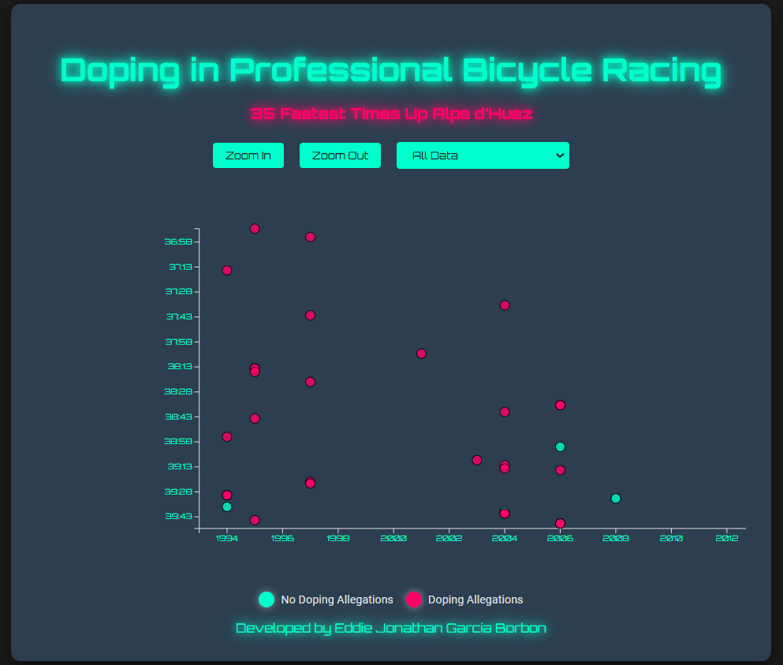

# **Scatterplot Graph: Doping in Professional Bicycle Racing**

 <!-- Add a screenshot of your project here -->

## **Project Description**
This project is an interactive scatterplot visualization of the **35 Fastest Times Up Alpe d'Huez** in professional bicycle racing, with a focus on doping allegations. Built using **D3.js**, the chart provides a modern and futuristic design with advanced features like zooming, filtering, and dynamic tooltips.

---

## **Key Features**
- **Interactive Scatterplot**: Visualizes the relationship between years and race times.
- **Dynamic Tooltip**: Displays detailed information (name, year, time, and doping allegations) when hovering over data points.
- **Zoom and Pan**: Allows users to zoom in and pan around the chart for detailed exploration.
- **Filtering**: Users can filter data points to show only doping allegations, no doping allegations, or all data.
- **Modern Design**: Neon colors, dark theme, and futuristic typography for a sleek and engaging look.
- **Responsive**: Adapts to different screen sizes for a seamless user experience.
- **Developer Credit**: Includes a footer with the developer's name.

---

## **Technologies Used**
- **HTML5**: Structure of the project.
- **CSS3**: Styling and modern design.
- **JavaScript**: Logic and interactivity.
- **D3.js**: Data visualization library.
- **Google Fonts**: Modern typography (Orbitron and Roboto).

---

## **How to Use**
1. Clone this repository or download the files.
2. Open the `index.html` file in your browser.
3. Interact with the chart:
   - **Hover** over the dots to see detailed information in the tooltip.
   - Use the **Zoom In** and **Zoom Out** buttons to explore the chart.
   - Use the **Filter** dropdown to show/hide data points based on doping allegations.

---

## **Project Structure**
scatterplot-graph/ 
│ 
├── index.html # Main HTML file 
├── styles.css # CSS styles for the project
├── script.js # JavaScript logic and D3.js visualization
├── README.md # Project documentation 
└── screenshot.png # Screenshot of the project (optional)

---

## **How to Contribute**
If you'd like to contribute to this project, follow these steps:
1. Fork the repository.
2. Create a new branch (`git checkout -b feature/new-feature`).
3. Make your changes and commit them (`git commit -m 'Add new feature'`).
4. Push to the branch (`git push origin feature/new-feature`).
5. Open a Pull Request.

---

## **Credits**
- **Developed by**: Eddie Jonathan Garcia Borbon
- **Data**: [freeCodeCamp](https://raw.githubusercontent.com/freeCodeCamp/ProjectReferenceData/master/cyclist-data.json)
- **Inspiration**: Data visualization projects with D3.js.

---

## **License**
This project is licensed under the **MIT License**. For more details, see the [LICENSE](LICENSE) file.

---

## **Related Links**
- [D3.js Documentation](https://d3js.org/)
- [freeCodeCamp Data Visualization Projects](https://www.freecodecamp.org/learn/data-visualization/)
- [Google Fonts](https://fonts.google.com/)

---

Thank you for checking out this project! If you have any questions or suggestions, feel free to reach out. 😊

---

### **Additional Notes**
- Make sure you have an internet connection to load Google Fonts and the dataset.
- You can customize the design and colors to suit your preferences.
